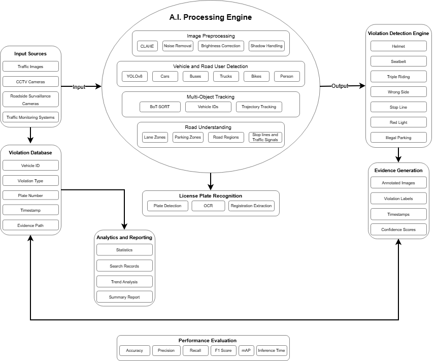

# 🛣️ **Gravelroad AI** 🛣️

## Introduction

Traffic surveillance systems generate large volumes of traffic images every day. Manual inspection of these images is quite time consuming, labor intensive and also prone to inconsistencies. This project proposes, **Gravelroad AI**, which is an intelligent computer vision platform capable of automatically detecting vehicles, identifying traffic violations, extracting vehicle information, and generating evidence against road laws for traffic law enforcement.

---

## Proposed Approach

The proposed solution, **Gravelroad AI**, is a computer-vision based traffic analysis platform that is designed to automatically identify, classify, and document various traffic violations from traffic photographs and surveillance imagery. The system’s main aim is to reduce dependency on manual monitoring by providing an intelligent and scalable framework that is capable of processing large volumes of traffic data efficiently.

The workflow begins with the acquisition of traffic images from multiple sources, which include CCTV cameras, roadside surveillance systems, traffic monitoring infrastructure, and photographic evidence.

The images are first passed through an image preprocessing stage where quality enhancement techniques are used, such as:

* Contrast Enhancement (CLAHE)
* Noise Removal
* Brightness Correction
* Shadow Handling

These techniques are applied to improve detection performance under various environmental conditions.

Once the images are enhanced, they are then processed by a vehicle and road-user detection system which is based on modern deep learning object detection models such as YOLOv8.

This system identifies and localizes different traffic participants, which includes:

* Cars
* Buses
* Trucks
* Motorcycles
* Bicycles
* Pedestrians

For video-based surveillance scenarios, a multi-object tracking system can further assign unique identities which will be able to detect vehicles and maintain their trajectories across consecutive frames.

To provide a contextual understanding of the traffic environment, the system also incorporates a road understanding component. This module defines:

* Lane Regions
* Parking Zones
* Road Boundaries
* Stop Lines
* Traffic Signal Regions

These enable violation-specific rule evaluation. By combining object detection results with road context information, the system can accurately determine whether a vehicle violates traffic regulation.

The violation detection engine serves as core decision-making component of the platform. It analyzes detected vehicles and road users and identifies multiple categories of traffic violations, ranging from:

* Helmet Non-Compliance
* Seatbelt Non-Compliance
* Triple Riding
* Wrong-Side Driving
* Stop-Line Violations
* Illegal Parking

Each and every detected violation is assigned a confidence score which indicates the reliability of the prediction and is categorized to predefined violation classes for further processing.

For vehicle identification, the system incorporates a License Plate Recognition (LPR) system. This module first detects the vehicle’s number plate and then subsequently applies Optical Character Recognition (OCR) techniques to extract the vehicle registration number from the image.

The extracted registration information is then linked to the corresponding violation record which enables efficient vehicle identification and enforcement actions.

In order to support traffic enforcement and auditing, the platform includes evidence generating module that automatically produces annotated images highlighting detected violations.

Each evidence record contains:

* Bounding Boxes
* Violation Labels
* Timestamps
* Confidence Scores
* Vehicle Registration Information

This ensures transparency and provides reliable and convenient evidence for traffic authorities.

All violation records are stored in a centralized violation database which enables efficient storage retrieval, and management of historical data.

An analytics and reporting module utilizes these records and generates:

* Violation Statistics
* Trend Analyses
* Searchable Reports
* Enforcement Summaries

These help assist traffic authorities in decision-making and resource allocation.

---

## System Architecture

The architecture of Gravelroad AI consists of six major components:

1. Input Sources
2. AI Processing Engine
3. Violation Detection Engine
4. License Plate Recognition
5. Evidence Generation
6. Analytics and Reporting

So, let's go through each of the components and how each of them work and lead to the entire system working well and effiriciently.

### Architecture Diagram

[Figure 1]

Figure 1 illustrates the overall architecture of Gravelroad AI and the interactions between the six major modules of the system.

### System Workflow Diagram

[Figure 2]

Figure 2 illustrates the complete workflow of the proposed system from traffic image acquisition to analytics generation.

### 1. Input Sources

The system takes inputs from:

1. CCTV Cameras
2. Roadside Surverillance Systems
3. Traffic Monitoring Infrastructure
4. Highway Monitoring Cameras
5. Smart City Surveillance Networks
6. Photographic Evidence Collected by Authorities

But all of the images are of varying environmental conditions such as: low-light scenarios, rain, shadows, glare, motion blur, partial occlusion and varying traffic densities. To combat this issue, all the images are first forwarded to the AI Processing Engine where the images are preprocessed and normalized before analysis begins.
The output are normalized images which are then forwarded to computer vision processing.

### 2 AI Processing Engine

This is the **perception layer of the system*. It transforms raw traffic images into structured visual information that is used for traffic analysis. One example of structured visual information is *red bounding boxes* used to highlight the vehicle is violating any road law.

The AI Processing Engine consists of four major sub-components:

#### 2.1 Image Preprocessing

Before preforming any task of detection, the incoming trafic images are first enhanced to improve the image quality and increase reliability of detection.

The stages of preprocessing are:
1. Contrast Enhancement using CLAHE
2. Brightness Normalization
3. Shadow Handling
4. Reduction of Noise
5. Motion Blur Reduction
6. Image Resizing and Standardization

#### 2.2 Vehicle and Road Detection

After preprocessing is completed, the images are forwarded to a YOLOv8-based detection system.

This module is responsible for detecting and localizing:

1. Cars
2. Buses
3. Trucks
4. Motorcycle
5. Bicycles
6. Pedestrians

Every single detected object has an individual:

1. Bounding Box Coordinate
2. Object Class
3. Confidence Score

#### 2.3 Multi-Object Tracking

For a video-based traffic monitoring scenario, a tracking system is incorporated to maintain the same identity for the same vehicle moving across multiple frames.

The tracking module uses BoT-SORT which assigns a unique identifier for each vehicle. These allow the system to monitor vehicle movement over time and supports analysis based on vehicle's behavior.

The tracking compenent enables:

1. Vehicle Trajectory Analysis
2. Same identity for the same vehicle across frames
3. Motion Pattern Understanding
4. Violation detection based on behavior of vehicle

#### 2.4 Road Understanding

To even detect traffic violations the road environment must be accurately detected to assign traffic violations accordingly.

The Road Understanding module defines:

1. Lane Regions
2. Parking Zones
3. Stop-Line Regions
4. Traffic Signal Regions
5. Restricted Areas

This serves as contextual information to the AI Processing Engine which helps it determine whether the vehicle is violating a traffic law rather than just detecting its presence.

### 3. Violation Detection Engine

This is the  brain of the Gravelroad AI system which makes the decisions.

Its purpose is to evaluate a detected vehicle against predefined traffic regulations and determine whether violation has occured.

Engine receives:
 
1.  Vehicle Detections
2.  Tracking Information
3.  Vehicle Trajectories
4.  Road Contextual Information

Using this the system analyses multiple categories of violations.

#### Helmet Non-Compliance

System checks identifies motorcycle riders and checks whether protective helmet is present or missing. Missing helmets are classified as helmet non-compliance violations.

#### Seatbelt Non-Compliance

The syste analyses the driver regions (the seat they are sitting on in the vehicle) and determines whether seatbelt is visible or not. Vehicles operating without visible seatbelts are flagged.

#### Triple Riding

System counts the number of rider on a two wheeler and compares the count againsts legal occupancy limits.

#### Stop-Line Violation

Position of a vehicle relative to a predefined stop-line region is evaluated. Vehicles that cross the stop-line under prohibited conditions are identified as violators.

#### Red-Light Violation

Vehicle movement patterns are analyzed alongside traffic signal states. Vehicles crossing intersections during a red signal phase are classified as red-light violators.

#### Illegal Parking

Vehicle movement patterns are constantly monitored. Vehicles that remain stationary within restricted parking zones for extended durations are classifed as illegal parking violations.

Each violation is assigned a:

1. Violation Category
2. Confidence Score
3. Timestamp
4. Vehicle Identifier

The resulting violation records are forwarded to the next stages of the system.

### 4. License Plate Recognition

Once a traffic violation has been detected, the system attempts to identify the vehicle associated with the violation through the License Plate Recognition (LPR) system.

Various stages of the LPR module are:

#### Number Plate Detection

The system first localizes the vehicle license plate within an image

#### Optical Character Recognition

After localization is completed, OCR techniques are applied to extract alphanumeric registration information from the plate. (Ex: MH13BN8454)

The extracted license number is mapped with the corresponding violation record and is then stored for future references.

This module enables:

1. Vehicle Identification
2. Violation Attribution
3. Enforcement Support
4. Searchable Vehicle Records

### 5. Evidence Generation

Evidence generation is one of the most critical components of the proposed system.

For every violation that is detected, the Evidence Generation module automatically creates supporting documentation for that particular vehicle that can be later reviewed by traffic authorities.

Each evidence record contains:

1. Annoteted Traffic Image
2. Bounding Boxes
3. Vehicle Identifier
4. Violation Category
5. Timestamp
6. Confidence Score
7. License Number (When available)

All evidence files are stored and linked to the corresponding violation record.

### 6. Analytics and Reporting

The final component of the architecture is responsible for transforming the collected records into understandable insights.

All detected violations are stored in a centralized violation database. The Analytics and Reporting module continuously processes these records to generated summaries based on the traffic law violators' behavior and keeps a history of their past violations. This is then used for trend analysis.

The analytics system provides:

1. Total Violation Statistics
2. Violation Frequency Analysis
3. Violation Distribution Visualization
4. Searchable Violation Records
5. Historical Violation Tracking
6. Traffic Enforcement Reports

These insights assist traffic authorities in identifying recurring traffic issues, helping them to allocate the resources needed for enforcement by authority efficiently. Also allows for long-term understanding of traffic behavior patterns.

---

## Assumptions

The proposed solution is developed under the following assumptions:

1. Traffic images and surveillance footage are of sufficient quality for object detection and analysis.
2. Vehicles and road users are reasonably visible and are not permanently occluded.
3. Traffic signs, road boundaries, lane markings, stop lines, and parking regions are either visible or can be defined using region-based rules.
4. Vehicle number plates are visible in at least a subset of captured images for OCR-based extraction.
5. Environmental factors such as rain, fog, low light, and shadows may affect detection accuracy but can be partially mitigated through preprocessing techniques.
6. The system is intended to assist traffic authorities and not replace human verification in critical enforcement decisions.

---

## Expected Evaluation Strategy

The effectiveness of Gravelroad AI will be evaluated using both detection and system level performance metrics.

### Detection and Classification Metrics

| Metric    | Purpose                                     |
| --------- | ------------------------------------------- |
| Accuracy  | Overall correctness of predictions          |
| Precision | Reduction of false positives                |
| Recall    | Reduction of false negatives                |
| F1-Score  | Balanced evaluation of precision and recall |
| mAP       | Object detection performance                |

These metrics assess the system’s ability to correctly identify vehicles, road users, and traffic violations while minimizing false positives and false negatives.

### License Plate Recognition Metrics

The License Plate Recognition module will be evaluated using:

* OCR Accuracy
* Character-Level Recognition Rate

### Evidence Generation Evaluation

Evidence generation will be assessed and verified based on:

* Correctness of Annotations
* Timestamp Accuracy
* Metadata Consistency
* Violation Classification Accuracy

### System Performance Metrics

Computational efficiency will be measured using:

* Inference Time
* Processing Throughput
* Frames Per Second (FPS)

Scalability will be evaluated by analyzing the system's performance under increasing traffic density and larger image datasets.

---

## Expected Outcomes

The proposed system is expected to automatically identify, classify and document multiple traffic violations from photographic evidence with minimal human intervention.

The platform’s aim is to reduce manual effort and improve consistency in traffic monitoring and provide with real time evidence for law enforcement by combining:

* Computer Vision
* Object Detection
* Tracking
* OCR
* Analytics

The system generates:

* Annotated Violation Records
* Vehicle Registration Information
* Searchable Violation Databases
* Statistical Insights

These capabilities can support traffic management authorities in making informed decisions.

---

## Future Scope

Future enhancements may include:

* Cloud-Based Deployment for Large-Scale City-Wide Monitoring
* Integration with Smart Traffic Infrastructure
* Automatic Challan Generation
* Real-Time Alert Systems
* Advanced Vehicle Re-Identification
* AI-Assisted Traffic Congestion Analysis

Additional violation categories and improved deep learning models can also be integrated to further increase the system’s accuracy and adaptability.
